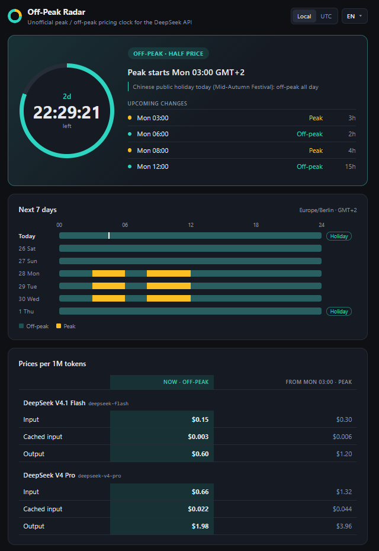

# Off-Peak Radar

**Unofficial peak / off-peak pricing clock for the DeepSeek API.**

A single-file web page that shows whether the DeepSeek API is currently in **peak** or **off-peak** (discounted) pricing, with a live countdown to the next change, a 7-day overview in your local time, and the current prices for every model.

**No prices, peak hours or holidays are stored in this project.** Everything is read live from the official sources each time the page is opened.

> Not affiliated with or endorsed by DeepSeek. See [Disclaimer](#disclaimer).

<!-- Screenshot placeholder: add the image to the repository as docs/screenshot.png -->


## Features

- Live countdown ring until the next peak / off-peak switch
- List of the upcoming changes and a 7-day overview of all price windows
- Local time (browser time zone, including daylight saving time) or UTC view
- Current and upcoming prices for all models listed on the official pricing page (input cache miss, input cache hit, output)
- Chinese public holidays taken into account (DeepSeek applies off-peak pricing all day on them)
- Available in English, German and Turkish (automatic from the browser language, switchable via dropdown)
- One `index.html` file, no build step, no dependencies, no backend

## How it works

When the page is opened, it loads its data once. It does not fetch again until the page is reloaded.

| Data | Source |
|---|---|
| Prices, models, peak hours, peak days, time zone | [Official DeepSeek pricing page](https://api-docs.deepseek.com/quick_start/pricing/). The pricing table and the "Peak hours are …" rule are parsed from the HTML. |
| Chinese public holidays | [NateScarlet/holiday-cn](https://github.com/NateScarlet/holiday-cn) via jsDelivr, based on the official gov.cn notices |

If DeepSeek changes a price, adds a model or moves the peak hours, the page picks up the change automatically. If the page can't be read or parsed, an error is shown instead of outdated values.

### Why a relay is needed

The DeepSeek documentation site doesn't send CORS headers, so a browser can't read it directly from another page. The page therefore tries these, in order, and uses the first one that returns a readable pricing page:

1. Direct request (in case CORS is enabled in the future)
2. [Jina Reader](https://jina.ai/reader/) (`r.jina.ai`)
3. [allorigins](https://allorigins.win/)
4. [codetabs](https://codetabs.com/)

These are free third-party services and can be slow or unavailable. For more reliability you can run your own relay (for example a small Cloudflare Worker) and add it at the top of the `PROXIES` list in `index.html`.

## Usage

- **Locally:** download `index.html` and open it in a browser.
- **GitHub Pages:** enable Pages for the repository (Settings → Pages → deploy from branch). The page is then available at `https://<user>.github.io/<repo>/`.

### URL parameters

| Parameter | Example | Description |
|---|---|---|
| `lang` | `?lang=tr` | Display language (`en`, `de`, `tr`, or any language added to `I18N`). Regional variants such as `de-AT` are accepted for date formats. Without it, the browser language is used, with English as the fallback. |
| `now` | `?now=2026-09-28T02:30:00Z` | Test clock: simulates another moment (ISO 8601; `Z` = UTC). The clock keeps ticking from there. Prices are still loaded live. |

Parameters can be combined:

```
index.html?lang=de&now=2026-10-01T03:00:00Z
```

Useful test moments:

| `now=` | Scenario |
|---|---|
| `2026-09-28T02:30:00Z` | Monday, during peak hours |
| `2026-09-26T12:00:00Z` | Saturday, off-peak all weekend |
| `2026-10-01T03:00:00Z` | Chinese National Day, off-peak all day |
| `2026-11-02T02:30:00Z` | Winter time: local peak hours shift by one hour |

## Adding a language

All texts are in the `I18N` object in `index.html`. To add a language:

1. Add an entry keyed by its language code (for example `fr: { ... }`). It appears in the language dropdown automatically.
2. Translate as many keys as you like. Missing keys fall back to English.
3. Optionally add the code to `HOLIDAY_NAMES` to translate the holiday names; otherwise English names are used.

Dates, weekdays and time zone names are formatted by the browser (`Intl.DateTimeFormat`) in the selected language.

## Limitations

- **Page structure:** the parser depends on the structure of the official pricing page. A redesign of that page can break it; in that case the page shows an error instead of wrong data.
- **Relays:** public CORS relays are outside this project's control. See [Why a relay is needed](#why-a-relay-is-needed).
- **Holidays:** holiday data comes from a community-maintained project. DeepSeek itself doesn't publish a list of dates.
- **Caching:** CDNs and relays may cache responses for a short time.

## Credits

- Pricing data: [DeepSeek API documentation](https://api-docs.deepseek.com/quick_start/pricing/)
- Holiday data: [NateScarlet/holiday-cn](https://github.com/NateScarlet/holiday-cn)
- Idea inspired by the [DeepSeek peak/off-peak price clock by DeepakNess](https://deepakness.com/deepseek/)

## Disclaimer

Off-Peak Radar is an independent, unofficial project. It is not affiliated with, endorsed by or sponsored by DeepSeek. "DeepSeek" is a trademark of its owner and is used here only to describe which service's pricing this tool displays. No DeepSeek logos or brand materials are used.

Prices are shown as found on the official page at the time of loading. Always check the [official pricing page](https://api-docs.deepseek.com/quick_start/pricing/) before making decisions based on them.
